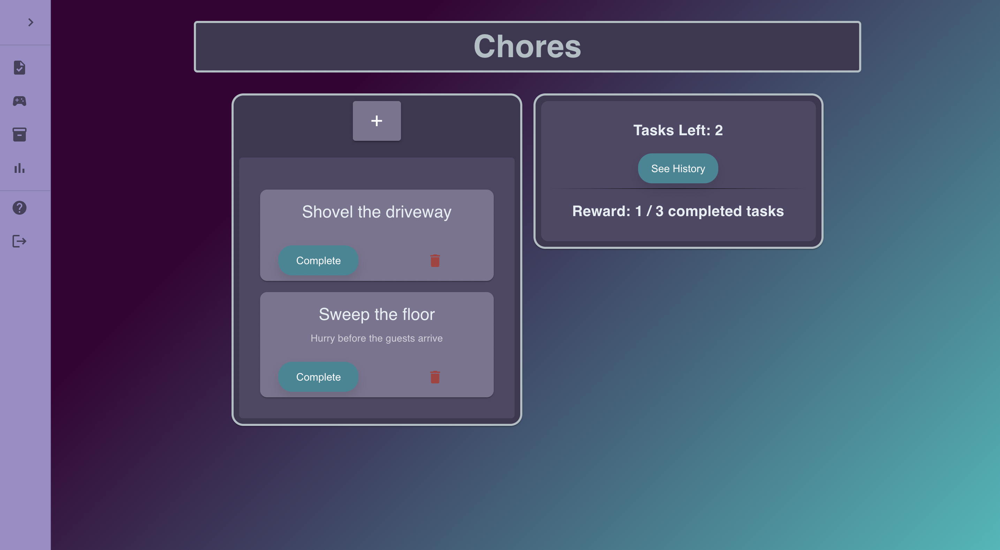
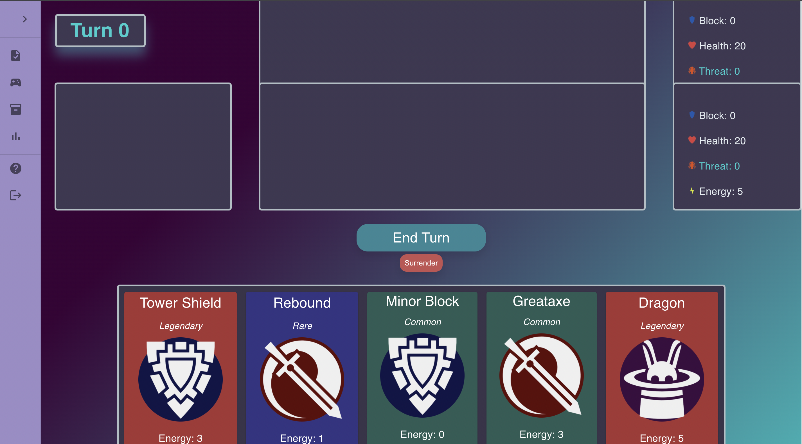
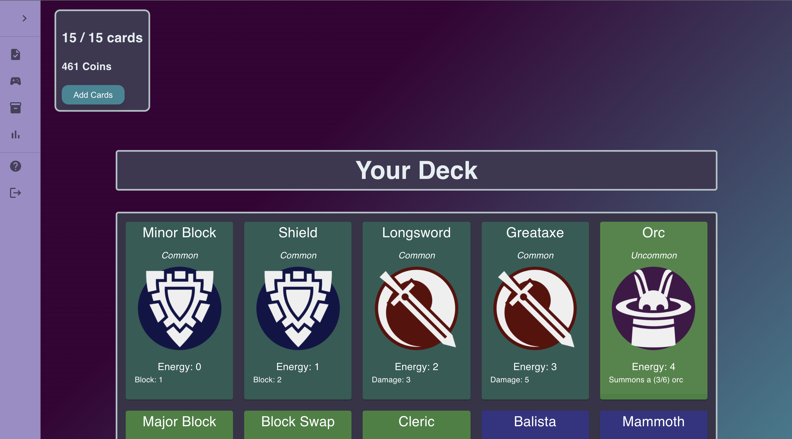
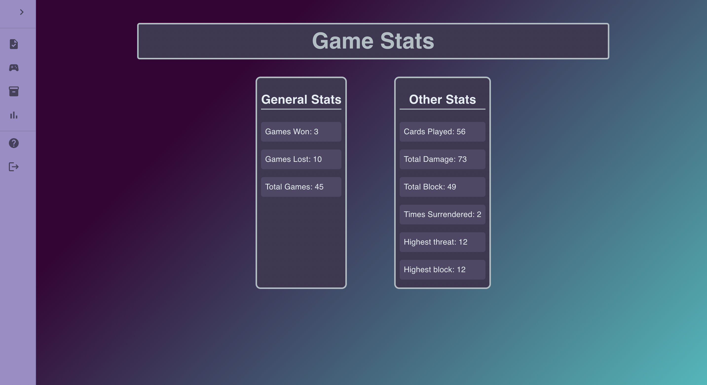

# Chore Slayer

## Description

_Duration: 4 week sprint_

Chore slayer is a to-do list app that helps you track your tasks, and incentivizes you to complete tasks with a game that’s built inside it. The game is similar to 'Magic the Gathering' or 'Hearthstone'. It allows you to build a deck by completing tasks, and uses that deck in the game. Whenever you complete 3 tasks, you earn a random amount of coins between 50 and 250. You can spend coins on cards inside the deck page. 

## Screen Shots

----

----

----

### Prerequisites

- [Node.js](https://nodejs.org/en/)
- Something to create a database

## Installation

1. Create a database named `chore_slayer`,
2. The queries in the `database.sql` file are set up to create all the necessary tables and populate the needed data to allow the application to run correctly. The project is built on [Postgres](https://www.postgresql.org/download/), so you will need to make sure to have that installed. I would recommend using Postico to run those queries as that was used to create the queries, 
3. Open up your editor of choice and run an `npm install`
4. Run `npm run server` in your terminal
5. Run `npm run client` in your terminal
6. The `npm run client` command will open up a new browser tab for you!

## Usage

1. Create an account or log in.
2. Once on the tasks page, you can press the '+' button to add a new task. After finishing a task, press 'Complete' on the card to mark it as complete. Tasks that are completed can be viewed on the history page by clicking the 'See History' button. Once you finish 3 tasks you will be able to claim a reward of 50 - 250 coins, which can be spent on the deck page.
3. On the left side of the screen is the sidebar, which will help you navigate to all the pages. Go to the deck page and look at all the cards in your deck. On this page you can click on a card to remove it from your deck, and click the 'Add Cards' button at the top of the page to add more.
4. Before you play your first game make sure to look at the help page, which explains all the rules in detail.
5. You can view the stats from all your games on the stats page. 

## Built With

- Javascript
- Node.js
- Express.js
- React
- Redux
- Sagas
- PostgreSQL
- MaterialUI

## Acknowledgement
Thanks to my entire cohort at [Prime Digital Academy](www.primeacademy.io), who supported me throughout the duration of the project, and my instructor Matt who taught us the content.

## Support
If you have suggestions or issues, please email me at smrdelb@gmail.com.
